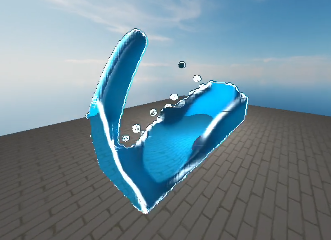
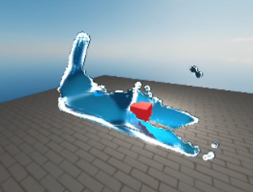

# An Implementation of [A Narrow Range Filter for Screen Space Fluid Rendering](https://dl.acm.org/doi/10.1145/3203201)

 

## Information

Loads a fluid simulation through `.abc` (alembic) files.

A narrow-range filter is applied for screen-spaced rendering of fluids.

Various rendering techniques are then applied to the resulting texture.

## Build Information

### External Libraries

- [cyCodeBase](https://github.com/cemyuksel/cyCodeBase)
- [glew-2.1.0](https://glew.sourceforge.net/)
- [glfw-3.4.0](https://github.com/glfw/glfw)
- [OpenGL](https://www.opengl.org/)
- [LodePNG](https://lodev.org/lodepng/)
- [Alembic](https://github.com/alembic/alembic)

CMake configuration is minimal - configure manually to set up dependencies.

## References

- [A Narrow-Range Filter for Screen-Space Fluid Rendering](https://dl.acm.org/doi/10.1145/3203201)
- [Visual Simulation of Turbulent Foams by Incorporating the Angular Momentum of Foam Particles into the Projective Framework](https://doi.org/10.3390/app12010133)
- [Efficient Representation of Detailed Foam Waves by Incorporating Projective Space](https://ieeexplore.ieee.org/document/7567502)
- [A Reflectance Graphics](https://graphics.pixar.com/library/ReflectanceModel/paper.pdf)
- [Path tracing the Cook-Torrance BRDF](https://computergraphics.stackexchange.com/questions/4394/path-tracing-the-cook-torrance-brdf)
- [Screen Space Fluid Rendering for Games](https://developer.download.nvidia.com/presentations/2010/gdc/Direct3D_Effects.pdf)
- [How to reconstruct normal from depth without artifacts on edge?](https://stackoverflow.com/questions/37627254/how-to-reconstruct-normal-from-depth-without-artifacts-on-edge)
- [Accurate Normal Reconstruction from Depth Buffer](https://atyuwen.github.io/posts/normal-reconstruction/)
- [Depth testing - OpenGL](https://learnopengl.com/Advanced-OpenGL/Depth-testing)
- [Gaussian Kernel - Gaussian Kernels and Other Locally Supported Models](https://www.sciencedirect.com/topics/computer-science/gaussian-kernel)
- [Bloom - OpenGL](https://learnopengl.com/Advanced-Lighting/Bloom)
